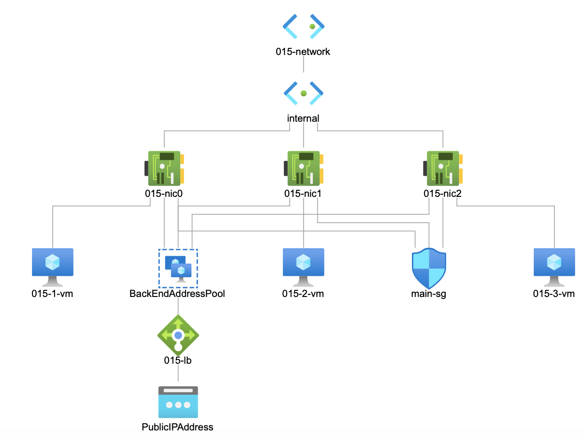
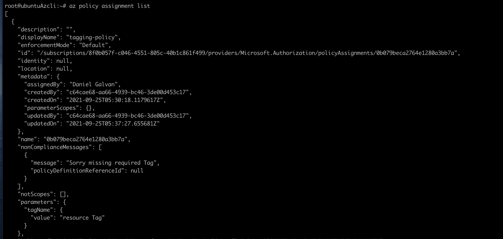

# Terraform Azurerm provider Project.

## Introduction
This repo containts my Terraform infrastucture as code that you can use to build
multiple VM's, a load balancer with a customcl Linux / Ubntu image

## Getting Started
To get started you will need the following.

* An Azure subscription [Azure free sub](https://azure.microsoft.com/en-us/)
* A computer with Linux, Windows or Mac.
* A text editor such as Vscode [Vscode](https://code.visualstudio.com/download)
* Lots of coffee.

## Dependencies
In order to use this code you will need the following

* Terraform [Terraform latest version.](https://www.terraform.io)
* The Azurerm provider (Instructions how to install on right corner)
* Azure CLI [Azurecli latest version](https://docs.microsoft.com/en-us/cli/azure/install-azure-cli)
* Packer, to creat images [Packger latest version](https://www.packer.io)
* the git client 

## Instructions

1. Clone this repo by typing "git clone https://github.com/Danxx26hub/iacCourseassign.git"
2. You will have a folder called iacCourassign, cd into the this folder.
3. find the Packer json file and enter your credentials for Azure.
4. You may need to create a "service principal account" (MS docs)[https://docs.microsoft.com/en-us/cli/azure/ad/sp#az_ad_sp_create_for_rbac]
5. You can find those using the Azure portal or the Azure CLI.
6. Initialize Packer by typing "Packer init .", rename the .json file to "server.json".
7. Run "Packer build -var 'resources=yourResource' server.json" this will build the image  (Note you will need to the -var allows you to set what resource group to put the image )
8. Type "Terraform init" to initialize your environment.
9. Type "Terraform plan -out project.out".
10. You will be asked how many VM's you want, The password to your VM's, a resource prefix and the username to use e.g. azureuser.
11. This will do a "dry run" of the build process.
12. Once you are satisfied with the output type "Terraform apply project.out", this will build the number of VM's of your choice, the Load Balancer and the Network Security group.
13. Login to your Azure account and get your static IP, Enjoy.

## Output
You will have something like the image below in the Topology section of the Azure Portal, in my example I picked 3 VM's.

### Tag Policy Screenshot
* Policy prevents resources from buing deployed wihtout tags.

