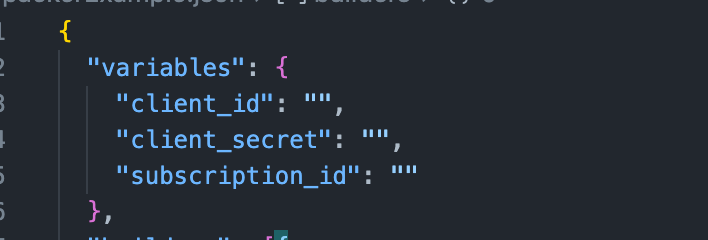
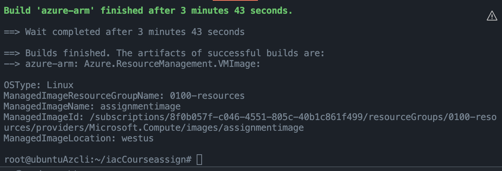
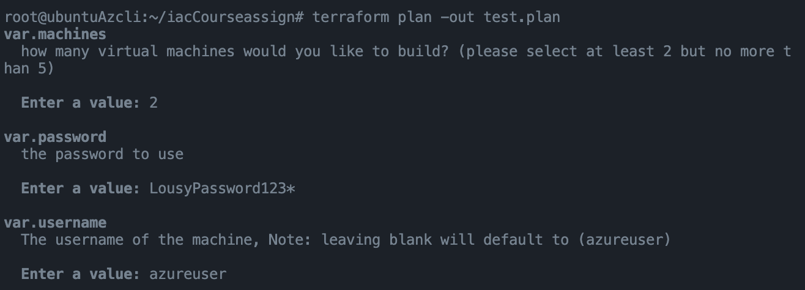

# Terraform Azurerm provider Project.

## Introduction
This repo containts my Terraform infrastucture as code that you can use to build
multiple VM's, a load balancer with a customcl Linux / Ubntu image

## Getting Started
To get started you will need the following.

* An Azure subscription [Azure free sub](https://azure.microsoft.com/en-us/)
* A computer with Linux, Windows or Mac.
* A text editor such as Vscode [Vscode](https://code.visualstudio.com/download)
* Lots of coffee.

## Dependencies
In order to use this code you will need the following

* Terraform [Terraform latest version.](https://www.terraform.io)
* The Azurerm provider (Instructions how to install on right corner)
* Azure CLI [Azurecli latest version](https://docs.microsoft.com/en-us/cli/azure/install-azure-cli)
* Packer, to creat images [Packger latest version](https://www.packer.io)
* A git client (to clone the repo) [git client](https://git-scm.com/downloads)

## Instructions

1. Clone this repo by typing "git clone https://github.com/Danxx26hub/iacCourseassign.git"
2. You will have a folder called iacCourassign, cd into the this folder.
3. find the Packer json file and enter your credentials for Azure.
4. You will need to create a "Service Principal" account
5. You can find those using the Azure portal or the Azure CLI.
    1. to create SPN account do the following in the az cli.
    2. Create an Azure Resource Group : az group create -n resourceGroup --tags Environment = Production -l region
    3. you will need the following:
        1. the clientd ID
        2. client secret 
        3. subscription ID
    4. run this az cli command:
    az ad sp create-for-rbac --query "{ client_id: appId, client_secret: password, tenant_id: tenant }"
    5. Then get subscription ID by running the following command:
    az account show --query "{ subscription_id: id }"
    6. Be sure to safeguard these id's and not share them with anyone.
    7. edit your "server.json" file and enter the three required id's
    
6. Initialize Packer by typing "Packer init .", rename the .json file to "server.json".
7. Run "Packer build -var 'resources=yourResource' server.json" this will build the image  (Note you will need to use the -var switch, this allows you to set what resource group to put the image )
8. Once the image is built and stored in Azure you will see the following:

8. Type "Terraform init" to initialize your environment.
9. Type "Terraform plan -out soution.plan".
    1. You can modify any of the variables in the variables.tf file
    to add or modify use the terraform "variable" block.
    2. The default variables will ask you to pick between 2 and 5 VM's, I used
    Terraform validation to ensure this stays between that range and will fail if not.
    3. you will be asked to enter a password for the machines (not great security)
    4. You will be asked to enter a resource group prifix BE SURE TO use the same as
    you used in the Packer .json file.
    

10. This will do a "dry run" of the build process.
    1. you will be presented with any changes that terraform will be making.
    2. any addtions will have "+" symbols and changes or deletions will have "-" symbols

    
11. Once you are satisfied with the output type "Terraform apply project.out", this will build the number of VM's of your choice, the Load Balancer and the Network Security group.
12. Login to your Azure account and get your static IP, Enjoy.

## Output
You will have something like the image below in the Topology section of the Azure Portal, in my example I picked 3 VM's.

### Tag Policy Screenshot
* Policy prevents resources from buing deployed wihtout tags.

